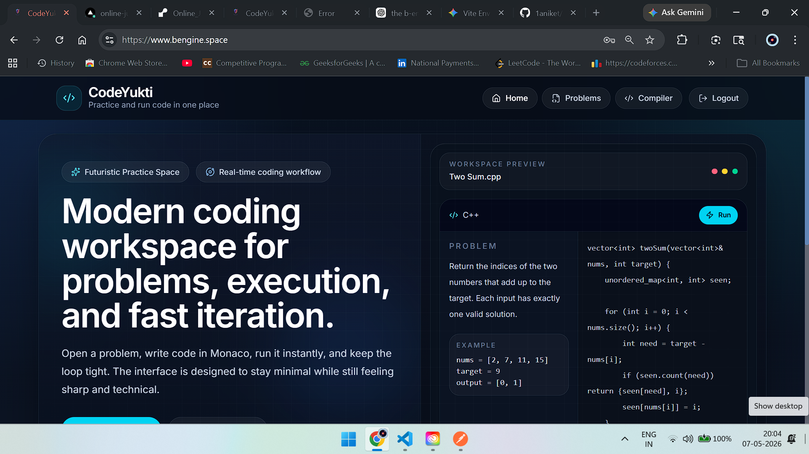

# B.Engine 🚀

> A modern online coding platform with isolated code execution, real-time judging, AI-assisted debugging, and production-grade deployment architecture.

🌐 Live Demo: https://bengine.space

---

# ✨ Features

- 🧠 AI-assisted error debugging
- ⚡ Real-time code execution
- 🔒 Hidden test case evaluation
- 🐳 Dockerized compiler service
- ☁️ Cloud deployment using EC2 + Vercel
- 🌍 Custom domain + HTTPS support
- 🧪 Multi-testcase execution support
- 🧱 Isolated compiler architecture
- 🎨 Minimal and developer-focused UI
- 📄 SEO-friendly problem slugs

---

# 🏗️ Architecture

```text
Frontend (Vercel)
        ↓
bengine.space
        ↓
Backend API
        ↓
Compiler Service (EC2 + Docker)
        ↓
Sandboxed Code Execution
```

---

# 🛠️ Tech Stack

## Frontend
- React
- Vite
- Tailwind CSS
- React Router DOM
- Axios

## Backend
- Node.js
- Express.js
- MongoDB
- Mongoose

## Compiler Infrastructure
- Docker
- AWS EC2
- Nginx Reverse Proxy

## Deployment
- Vercel
- AWS EC2
- Hostinger DNS
- SSL via Certbot

---

# 🔥 Core Engineering Highlights

## 🐳 Dockerized Compiler Service

The compiler runs inside isolated Docker containers to provide:

- safer execution
- environment consistency
- scalable infrastructure

---

## 🔒 Hidden Test Case System

Hidden test cases are never exposed to the frontend.

Only visible examples are sent to users while actual evaluation happens securely on the backend.

---

## 🌐 Production Deployment

The platform uses a distributed deployment architecture:

| Service | Platform |
|---|---|
| Frontend | Vercel |
| Compiler Service | AWS EC2 |
| Reverse Proxy | Nginx |
| Domain Management | Hostinger |

---

# 📂 Project Structure

```bash
Online_Judge/
│
├── client/        # React frontend
├── server/        # Backend API
├── compiler/      # Compiler execution service
│
└── README.md
```

---

# ⚙️ Local Setup

## 1️⃣ Clone Repository

```bash
git clone https://github.com/1aniket/Online_Judge.git
cd Online_Judge
```

---

## 2️⃣ Setup Frontend

```bash
cd client
npm install
npm run dev
```

---

## 3️⃣ Setup Backend

```bash
cd server
npm install
npm run dev
```

---

## 4️⃣ Setup Compiler Service

```bash
cd compiler
docker build -t compiler-service .
docker run -p 7001:7000 compiler-service
```

---

# 🔑 Environment Variables

## Frontend (`client/.env`)

```env
VITE_API_URL=https://api.bengine.space
```

---

## Backend (`server/.env`)

```env
MONGO_URI=your_mongodb_uri
JWT_SECRET=your_secret
COMPILER_URL=https://compiler.bengine.space
```

---

# 🚀 Future Improvements

- Queue-based execution system
- Per-submission isolated containers
- Submission history
- Contest system
- User authentication
- Rate limiting
- Execution monitoring
- Runtime analytics
- Multi-language support

---

# 📸 Screenshots


Example:

```md



```

---

# 🧠 Learnings From This Project

This project involved hands-on experience with:

- distributed deployment architecture
- Docker containerization
- reverse proxy setup using Nginx
- SSL configuration
- cloud deployment
- secure code execution pipelines
- frontend-backend integration
- environment-based configuration management

---

# 🤝 Contributing

Contributions, ideas, and feedback are welcome.

Feel free to fork the repository and submit a PR.

---

# 📬 Contact

## Aniket Bhogawar

- 🌐 Portfolio: https://aniketbhogawar.online
- 💼 LinkedIn: https://www.linkedin.com/in/aniketbhogawars/
- 🧑‍💻 GitHub: https://github.com/1aniket

---

# ⭐ Support

If you liked this project, consider giving it a star ⭐ on GitHub.
